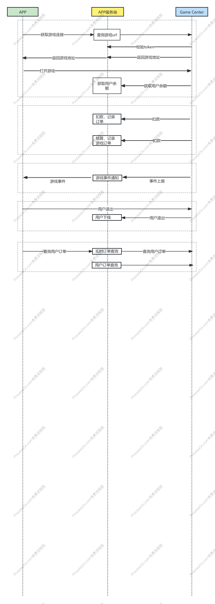

# platform-api-doc
游戏中心后端服务，提供游戏信息、供应商、分类、订单及转账记录等能力。


## 平台接入说明

### 作为调用方请求 Game Center（/oapi/*）

业务网关、运营后台等需要调用 Game Center 时，请求以 **`/oapi/*`** 开头的接口。

- **鉴权**：请求头需携带 **`token`**。Token 由 Game Center 的 `game-proxy.accessKey`、`game-proxy.service` 等配置生成（JWT），`GameProxyFilter` 会校验，校验失败返回 4xx。
- **接口路径**：与上文“可选接口”一致，例如游戏 URL、余额、上下分、订单查询等，均由 Game Center 内部转发到对应游戏 Proxy 或本地逻辑处理。
- **错误处理**：部分接口在异常时返回 JSON-RPC 风格错误信息，可参考 `GlobalExceptionAdvice` 中对 `/game-proxy/*` 的封装。

调用方需使用与上述配置兼容的 JWT 生成 `token`，并在请求头中传入。

#### 接入流程

调用方接入 Game Center 的推荐步骤如下：

1. **获取接入配置**：向 Game Center 维护方申请 `accessKey`、`service` 及接口 Base URL（如 `https://game-center.example.com`）。
2. **生成 JWT Token**：使用 `accessKey` 作为密钥，按约定生成 JWT，Payload 中建议包含 `service`、`exp` 等字段，过期时间与 Game Center 配置的 `game-proxy.exp` 一致（如 30 分钟）。
3. **调用接口**：请求时在 Header 中携带 `token: <JWT>`，Body 使用 JSON-RPC 2.0 格式（与 Game Proxy 约定一致）。
4. **联调与验收**：先调用健康检查或简单接口（如余额查询）确认鉴权与网络正常，再按业务需要对接游戏 URL、上下分、订单等接口。

接入流程示意如下：



配置示例（`application-dev.yml`）：

```yaml
game-proxy:
  accessKey: game-proxy-10086
  exp: 30
  service: game-proxy
```

#### 接入说明（客户端 + App 服务端）

以下为**客户端通过游戏中心进入游戏**的完整流程，以及游戏中心与 **App 服务端**的协作方式。

1. **客户端通过游戏 ID 获取进入游戏的 URL**  
   客户端调用游戏中心接口，传入游戏 ID 及用户身份信息，获取可用的游戏地址。  
   - 接口：`POST /game-center/game/enter`  
   - 请求头：`token`（由 App 服务端签发）、`device`、`language`、`x-ip`、`x-country` 等  
   - 请求体：`gameId`、`groupId`、`returnUrl` 等  
   - 响应：返回游戏 URL、打开方式（如 WebView）、横竖屏等，客户端用该 URL 打开游戏。

2. **客户端通过 WebView 打开游戏 URL**  
   客户端使用上一步返回的 URL 在 WebView（或内嵌浏览器）中打开，用户即可在 App 内进行游戏。

3. **游戏中心校验用户 Token**  
   客户端请求游戏中心时携带的 `token` 由 **App 服务端**签发。游戏中心会校验该 token（当前实现为使用与 App 约定一致的密钥 `game-core.token.key` 做本地 JWT 校验）。若接入方案为「游戏中心调用 App 服务端校验」，则 App 需提供 token 校验接口供游戏中心调用。

4. **游戏中心调用 App 服务端获取用户余额**  
   在进入游戏前或游戏中，游戏中心需要获取用户余额（如校验准入、展示余额）。  
   - 游戏中心会调用 **App 服务端**接口：`POST /oapi/score/balance`  
   - 请求头：`token`（游戏中心与 App 约定的服务端 token，见 `game-core.oapi` 等配置）  
   - 请求体：`kolUserId`、`userId`、`cardTypeCode`（币种）等  
   - App 需返回当前用户在该币种下的余额等信息。

5. **游戏过程中游戏中心扣/加用户积分**  
   游戏过程中产生的上下分（如投注扣款、派彩加款），由游戏中心与游戏厂商（Game Proxy）交互后，再通过 **App 服务端**完成实际积分变动。  
   - 游戏中心会调用 **App 服务端**接口：`POST /oapi/score/cost`  
   - 请求头：`token`  
   - 请求体：`kolUserId`、`userId`、`currency`、`score`（扣/加分数，正负表示方向）、`gameId`、`bizId`、`gameSupplierId` 等  
   - App 需完成扣款或加款，并返回扣款后余额等信息。

**小结**：客户端仅需通过「游戏 ID → 获取 URL → WebView 打开」接入；Token 校验、余额查询、积分扣加均由游戏中心与 App 服务端通过上述接口配合完成。App 服务端需实现并暴露 `/oapi/score/balance`、`/oapi/score/cost`，并确保与游戏中心在 token、Base URL 上配置一致（如 `game-core.oapi.url`、`game-core.oapi.token`）。

---

## 接入平台需要实现的接口说明

接入平台（App 服务端）需实现以下接口，供游戏中心在获取用户余额、扣/加积分、查询优惠券时调用。请求的 Base URL 与 token 由游戏中心配置（如 `game-core.oapi.url`、`game-core.oapi.token`），游戏中心会通过 Feign 调用这些接口。

**通用约定**：
- 请求头需支持 **`token`**，游戏中心会传入与平台约定的服务端 token。
- 响应体为 **`SingleResponse<T>`** 格式：成功时 `result` 为业务数据，失败时 `error` 为错误信息。

---

### 1. 获取用户余额（userBalance）

游戏中心在进入游戏前、游戏中查询余额时会调用该接口。

- **接口路径**：`POST /oapi/score/balance`
- **请求头**：`token`（必填）
- **请求体**：JSON，`UserBalanceForGameReq`

| 参数 | 类型 | 必填 | 说明 |
|------|------|------|------|
| kolUserId | Long | 是 | KOL/一级用户 ID（A0） |
| userId | Long | 是 | 用户 ID |
| cardTypeCode | String | 否 | 币种，如 USD、VND |

- **响应**：`SingleResponse<UserBalanceResp>`

| 字段 | 类型 | 说明 |
|------|------|------|
| result.score | String | 用户在该币种下的余额 |
| result.currency | String | 币种 |
| result.userId | Long | 用户 ID |
| result.kolUserId | Long | KOL 用户 ID |
| result.avatar | String | 头像（可选） |
| result.nickname | String | 昵称（可选） |
| result.gender | Integer | 性别（可选） |
| result.familyId | Long | 家族 ID（可选） |

**使用场景**：进入游戏前校验准入、展示余额；非免转游戏上分前查余额；退出游戏时带出余额前查询等。

---

### 2. 抵扣/增加积分（costScore）

游戏过程中扣款（下注）或加款（派彩）时，游戏中心调用该接口在平台侧完成实际积分变动。

- **接口路径**：`POST /oapi/score/cost`
- **请求头**：`token`（必填）
- **请求体**：JSON，`UserCostScoreReq`

| 参数 | 类型 | 必填 | 说明 |
|------|------|------|------|
| score | BigDecimal | 是 | 变动积分：正数为加款，负数为扣款 |
| bizId | Long | 是 | 业务流水号（游戏中心生成，用于幂等/对账） |
| gameId | String | 是 | 游戏 ID（游戏中心侧） |
| gameSupplierId | String | 是 | 游戏厂商 ID |
| userId | Long | 是 | 用户 ID |
| kolUserId | Long | 是 | KOL 用户 ID |
| currency | String | 否 | 币种 |
| voucherId | Long | 否 | 代金券 ID（使用代金券时传入） |

- **响应**：`SingleResponse<UserCostScoreResp>`

| 字段 | 类型 | 说明 |
|------|------|------|
| result.userId | Long | 用户 ID |
| result.score | String | 扣款/加款后的余额 |
| result.currency | String | 币种 |
| result.usedVoucherScore | BigDecimal | 实际使用代金券金额（若有） |
| result.voucherId | Long | 使用的代金券 ID |
| result.actualUsedScore | BigDecimal | 实际扣用的积分 |
| result.payBetTimes | BigDecimal | 代金券打码倍数 |
| result.voucherTransactionId | Long | 本次代金券使用流水 ID |

**使用场景**：用户上分到游戏（加款）、下注扣款、派彩加款、下分回平台（扣款）等，均由游戏中心在适当时机调用本接口。

---

### 3. 获取用户优惠券列表（getUserVoucherList）

游戏中心需要展示或使用用户优惠券（代金券）时调用。

- **接口路径**：`POST /oapi/voucher/list`
- **请求头**：`token`（必填）
- **请求体**：JSON，`UserVoucherForGameReq`

| 参数 | 类型 | 必填 | 说明 |
|------|------|------|------|
| kolUserId | Long | 是 | KOL 用户 ID |
| userId | Long | 是 | 用户 ID |
| cardTypeCode | String | 是 | 币种 |
| page | Integer | 否 | 页码，从 1 开始 |
| size | Integer | 否 | 每页条数 |
| gameId | String | 否 | 游戏 ID，用于功能范围过滤 |
| gameSupplierId | String | 否 | 游戏厂商 ID，用于全局范围过滤 |

- **响应**：`SingleResponse<UserVoucherForGameResp>`

| 字段 | 类型 | 说明 |
|------|------|------|
| result.total | Long | 总记录数 |
| result.list | Array | 优惠券列表，每项为 UserVoucherItem |

**UserVoucherItem 字段**：id、voucherId、userId、kolUserId、cardTypeCode、balance（优惠券余额）、originalScore、useScene、isUsed、payBetTimes（打码倍数）、voucherValidFrom、voucherValidTo、usageScope、globalScope、moduleScope、featureScope。

**使用场景**：游戏内展示可用代金券、使用代金券抵扣时由游戏中心先查列表再在扣款时传 `voucherId`。

---

## 接口说明

### 获取游戏列表接口

分页查询游戏信息，支持多条件筛选；可与 A0 配置联动，排除指定 KOL 下已配置的游戏。

- **接口路径**：`POST /oapi/game-info/page`
- **请求头**：`language`（必填，语言，如 `en`、`zh`）
- **请求体**：JSON，继承分页参数并包含以下可选查询条件。

#### 请求体说明（GameInfoQueryDTO）

| 参数 | 类型 | 必填 | 说明 |
|------|------|------|------|
| page | Integer | 是 | 页码，从 1 开始 |
| size | Integer | 是 | 每页条数 |
| sortName | String | 否 | 排序字段名 |
| sortOrder | String | 否 | 排序方向，如 `ASC`、`DESC`，默认 `DESC` |
| language | String | 否 | 语言（也可仅依赖 Header），用于国际化名称等 |
| id | Long | 否 | 游戏 ID（精确） |
| ids | List\<Long\> | 否 | 游戏 ID 列表（批量） |
| filterA0 | Boolean | 否 | 是否按 A0 过滤：为 true 时排除该 KOL 已配置的游戏，需同时传 kolUserId |
| kolUserId | Long | 否 | KOL 用户 ID，filterA0 为 true 时必填 |
| filterUsed | Boolean | 否 | 是否过滤已使用游戏，为 true 时使用 excludeGameIds 排除 |
| excludeGameIds | List\<Long\> | 否 | 要排除的游戏 ID 列表 |
| thirdGameId | String | 否 | 三方游戏 ID |
| platformGameId | String | 否 | 平台游戏 ID |
| gameCode | String | 否 | 游戏编码 |
| supplierId | Long | 否 | 游戏厂商 ID |
| supplierIds | List\<Long\> | 否 | 游戏厂商 ID 列表 |
| gameSupplierName | String | 否 | 游戏厂商名称（模糊） |
| gameCategoryId | Long | 否 | 游戏类别 ID |
| gameModuleId | Long | 否 | 游戏二级类别 ID |
| state | Integer | 否 | 状态：0 关闭，1 开启 |
| needAudit | Integer | 否 | 是否需要稽核：0 否，1 是 |
| needPullOrder | Integer | 否 | 是否需要采集数据 |
| gameWalletType | Integer | 否 | 免转类型：0 非免转，1 免转 |
| isGroupTrace | Integer | 否 | 是否语音房游戏 |
| isOrderDetail | Integer | 否 | 是否有订单详情 |
| gameFlag | String | 否 | 游戏标识 |
| createTimeStart | Date | 否 | 创建时间起 |
| createTimeEnd | Date | 否 | 创建时间止 |
| modifyTimeStart | Date | 否 | 修改时间起 |
| modifyTimeEnd | Date | 否 | 修改时间止 |
| gameName | String | 否 | 游戏名称（国际化模糊查询） |
| currency | String | 否 | 货币类型，如 VND、CNY、USD |
| openType | Integer | 否 | 打开方式：0 iframe，1 直接跳转 |
| gameCategoryCodes | List\<String\> | 否 | 游戏类别编码列表 |
| multiPlayer | Integer | 否 | 是否多人游戏：0 单人，1 多人 |
| playType | Integer | 否 | 游戏类型：0 平台 URL 开始，1 语音房 SDK 开始 |
| freeGame | Integer | 否 | 1 免费游戏，2 收费游戏 |
| rl | Integer | 否 | rl 字段 |

#### 响应说明

- **Content-Type**：`application/json`
- **Body**：`SingleResponse<PageResult<GameInfoDTO>>`

| 字段 | 类型 | 说明 |
|------|------|------|
| result | Object | 分页结果 |
| result.total | Long | 总条数 |
| result.list | Array | 当前页游戏列表，每项为 GameInfoDTO |

**GameInfoDTO 主要字段**：`id`、`platformGameId`、`thirdGameId`、`supplierId`、`platformSupplierId`、`gameCategoryId`、`platformGameCategoryId`、`gameCode`、`imgIconId`、`thumbnailIconId`、`state`、`sortNo`、`country`、`language`、`device`、`currencies`、`needAudit`、`needPullOrder`、`gameWalletType`、`enterGameLimit`、`transferLimitAmount`、`maintainBeginTime`、`maintainEndTime`、`gameProxyUrl`、`isGroupTrace`、`isOrderDetail`、`gameName`、`gameSupplierName`、`gameCategoryName`、`openType`、`screen`、`multiPlayer`、`playType`、`rtp`、`freeGame`、`rl` 等。

#### 请求示例

```json
POST /oapi/game-info/page
Headers:
  language: zh

Body:
{
  "page": 1,
  "size": 20,
  "state": 1,
  "gameCategoryId": 10,
  "filterA0": true,
  "kolUserId": 10001
}
```

#### 响应示例

```json
{
  "result": {
    "total": 100,
    "list": [
      {
        "id": 1,
        "platformGameId": "xxx",
        "thirdGameId": "yyy",
        "supplierId": 5,
        "gameCategoryId": 10,
        "state": 1,
        "gameName": "游戏名称",
        "gameProxyUrl": "https://...",
        "openType": 0,
        "screen": 1
      }
    ]
  }
}
```

---

### 进入游戏（获取游戏链接）接口

客户端通过该接口根据游戏 ID 等信息获取可用的游戏地址，用于在 WebView 中打开游戏。游戏中心会校验 token、余额与游戏状态，并按需完成上分。

- **接口路径**：`POST /game-center/game/enter`
- **请求头**：以下均为必填

| 参数 | 类型 | 说明 |
|------|------|------|
| token | String | 由 App 服务端签发的 JWT，游戏中心用其解析出 userId、kolUserId |
| x-ip | String | 用户 IP |
| device | String | 设备类型 |
| language | String | 语言，如 en、zh |
| x-country | String | 国家/地区 |

- **请求体**：JSON（GameUrlReqDTO），`userId`、`kolUserId` 由服务端从 token 解析，无需客户端传。

#### 请求体说明（GameUrlReqDTO）

| 参数 | 类型 | 必填 | 说明 |
|------|------|------|------|
| currency | String | 是 | 币种，如 USD、VND、CNY |
| gameId | Long | 否 | 游戏 ID，默认 0；与厂商/类别组合使用时可传 0 |
| gameSupplierId | Long | 否 | 游戏厂商 ID |
| gameCategoryId | Long | 否 | 游戏类别 ID |
| groupId | String | 否 | 房间/组 ID（如语音房场景） |
| isGroupTrace | Integer | 否 | 是否从语音房进入：0 否，1 是，默认 0 |
| isDemo | Integer | 否 | 是否试玩：0 否，1 是，默认 0 |
| returnUrl | String | 否 | 退出或返回时的跳转地址 |

#### 响应说明

- **Content-Type**：`application/json`
- **Body**：`SingleResponse<GameUrlRespDTO>`

| 字段 | 类型 | 说明 |
|------|------|------|
| result | Object | 游戏链接结果 |
| result.url | String | 游戏地址，客户端用 WebView 打开此 URL |
| result.config | Object | 扩展配置（可选） |
| result.openType | Integer | 打开方式：0 iframe 内嵌，1 浏览器/直接跳转 |
| result.screen | Integer | 屏幕方向：0 横屏，1 竖屏 |

#### 请求示例

```json
POST /game-center/game/enter
Headers:
  token: <JWT>
  x-ip: 192.168.1.1
  device: ios
  language: zh
  x-country: CN

Body:
{
  "currency": "USD",
  "gameId": 100,
  "groupId": "room_001",
  "isGroupTrace": 0,
  "isDemo": 0,
  "returnUrl": "https://app.example.com/back"
}
```

#### 响应示例

```json
{
  "result": {
    "url": "https://game-provider.example.com/launch?token=xxx&...",
    "config": null,
    "openType": 0,
    "screen": 1
  }
}
```

**说明**：客户端拿到 `result.url` 后，根据 `openType`、`screen` 在 WebView 或浏览器中打开；游戏过程中的余额、上下分由游戏中心与 App 服务端通过 `/oapi/score/balance`、`/oapi/score/cost` 等接口配合完成。

---

### 订单查询接口（query）

分页查询用户游戏订单列表，数据来自订单采集库，支持多条件筛选与汇总统计。

- **接口路径**：`POST /oapi/game-order/queryV2`
- **请求头**：`language`（可选，语言）
- **请求体**：JSON（UserOrderQueryDTO），继承分页参数。

#### 请求体说明（UserOrderQueryDTO）

| 参数 | 类型 | 必填 | 说明 |
|------|------|------|------|
| page | Integer | 是 | 页码，从 1 开始 |
| size | Integer | 是 | 每页条数 |
| sortName | String | 否 | 排序字段 |
| sortOrder | String | 否 | 排序方向，如 ASC、DESC |
| kolUserId | Long | 否 | KOL 用户 ID |
| userId | Long | 否 | 用户 ID |
| userIdList | List\<Long\> | 否 | 用户 ID 列表（批量） |
| orderId | String | 否 | 订单 ID |
| gameId | Long | 否 | 游戏 ID |
| platformGameId | String | 否 | 平台游戏 ID |
| gameCategoryId | Long | 否 | 游戏类别 ID |
| platformCategoryId | String | 否 | 平台类别 ID |
| gameSupplierId | Long | 否 | 游戏厂商 ID |
| platformGameSupplierId | String | 否 | 平台厂商 ID |
| state | Integer | 否 | 订单状态：0 未结算，1 赢，2 和，3 输，4 用户取消，5 系统取消，7 异常 |
| beginTime | String | 否 | 开始时间，格式 yyyy-MM-dd HH:mm:ss |
| endTime | String | 否 | 结束时间 |
| createTimeStart | Long | 否 | 创建时间开始时间戳（毫秒），会转换为 beginTime |
| createTimeEnd | Long | 否 | 创建时间结束时间戳（毫秒），会转换为 endTime |
| currency | String | 否 | 币种，为空时查所有币种 |
| timeZone | Integer | 否 | 时区：0 北京/新加坡，1 美东，2 不转时区，默认 0 |
| timeType | Integer | 否 | 快捷时间：0 最近 1 天，1 最近 3 天，3 最近 7 天，4 最近 30 天；与 beginTime 同时传时以 beginTime 为准 |
| isGetDetail | Integer | 否 | 是否获取订单详情：0 否，1 是 |
| hasStat | Integer | 否 | 是否需要统计，接口内部会设为 1 |

#### 响应说明（UserOrderRespDTO）

| 字段 | 类型 | 说明 |
|------|------|------|
| result.total | Long | 总条数 |
| result.totalBetScore | BigDecimal | 总下注金额 |
| result.totalSettleScore | BigDecimal | 总结算金额 |
| result.totalValidScore | BigDecimal | 总有效金额 |
| result.list | Array | 订单列表，每项为 UserOrderDTO |

**UserOrderDTO 主要字段**：kolUserId、userId、gameId、gameName、gameSupplierId、gameSupplierCode、gameSupplierName、gameCategoryId、gameCategoryName、orderId、currency、state、betTime、betScore、settleScore、netScore、validScore、settleTime、groupId、isSettle、gameInfo、isOrderDetail。

#### 请求示例

```json
POST /oapi/game-order/queryV2
Headers:
  language: zh

Body:
{
  "page": 1,
  "size": 20,
  "kolUserId": 10001,
  "userId": 20002,
  "currency": "USD",
  "timeType": 3,
  "timeZone": 0
}
```

---

### 订单统计接口（stat）

按用户、时间、币种等维度统计游戏订单汇总数据（总下注、总结算、总有效等）。

- **接口路径**：`POST /oapi/game-order/stat`
- **请求体**：JSON（OrderStatReqDTO），继承分页参数。

#### 请求体说明（OrderStatReqDTO）

| 参数 | 类型 | 必填 | 说明 |
|------|------|------|------|
| page | Integer | 是 | 页码，从 1 开始 |
| size | Integer | 是 | 每页条数 |
| kolUserId | Long | 否 | KOL 用户 ID |
| userIds | List\<Long\> | 否 | 用户 ID 列表 |
| currency | String | 否 | 币种 |
| groupId | String | 否 | 房间/组 ID |
| beginTime | String | 否 | 开始时间，格式 yyyy-MM-dd HH:mm:ss |
| endTime | String | 否 | 结束时间 |
| isSettle | Integer | 否 | 是否已结算：0 否，1 是，默认 1 |
| state | Integer | 否 | 订单状态：0 未结算，1 赢，2 和，3 输，4 用户取消，5 系统取消，7 异常 |
| timeZone | Integer | 否 | 0 北京/新加坡时间，1 美东时间 |
| gameInfo | Object | 否 | 游戏信息（GameInfoReqDTO），用于指定游戏维度 |

#### 响应说明（UserStatRespDTO）

| 字段 | 类型 | 说明 |
|------|------|------|
| result.total | Long | 总条数 |
| result.totalBetScore | BigDecimal | 总下注金额 |
| result.totalSettleScore | BigDecimal | 总结算金额 |
| result.totalValidScore | BigDecimal | 总有效金额 |
| result.list | Array | 统计明细列表，每项为 OrderStatDTO |

**OrderStatDTO 主要字段**：gameId、groupId、gameSupplierId、gameCategoryId、currency、betScore、settleScore、validScore、userId。

#### 请求示例

```json
POST /oapi/game-order/stat
Body:
{
  "page": 1,
  "size": 20,
  "kolUserId": 10001,
  "userIds": [20001, 20002],
  "currency": "USD",
  "beginTime": "2025-01-01 00:00:00",
  "endTime": "2025-01-31 23:59:59",
  "isSettle": 1,
  "timeZone": 0
}
```

#### 响应示例

```json
{
  "result": {
    "total": 2,
    "totalBetScore": 1000.00,
    "totalSettleScore": 1050.00,
    "totalValidScore": 980.00,
    "list": [
      {
        "gameId": 100,
        "groupId": "room_001",
        "gameSupplierId": 5,
        "gameCategoryId": 10,
        "currency": "USD",
        "betScore": 500.00,
        "settleScore": 520.00,
        "validScore": 490.00,
        "userId": 20001
      }
    ]
  }
}
```
